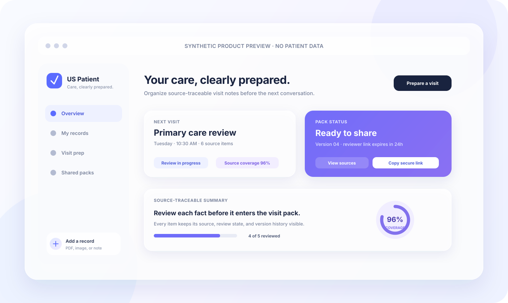
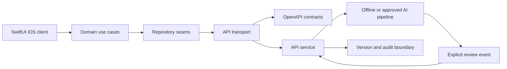

<p align="center">
  
</p>

<h1 align="center">US Patient App · iOS</h1>

<p align="center">
  A bilingual iOS workspace for turning personal records into source-traceable visit preparation packs.
</p>

<p align="center">
  <a href="https://github.com/Frankie-Xu/us-patient-app-ios/actions/workflows/ci.yml"></a>
  
  
  
</p>

<p align="center">
  <a href="#quick-start">Quick start</a> ·
  <a href="#architecture-and-data-flow">Architecture</a> ·
  <a href="#privacy-and-safety-boundaries">Privacy</a> ·
  <a href="docs/platform/repository-governance.md">Governance</a> ·
  <a href="CONTRIBUTING.md">Contributing</a> ·
  <a href="SECURITY.md">Security</a>
</p>

> **Synthetic preview:** the hero image and every checked-in fixture use synthetic or de-identified content. Do not add real patient records, credentials, tokens, or vendor payloads to this public repository.

## Table of contents

- [Product at a glance](#product-at-a-glance)
- [Interface direction](#interface-direction)
- [What it includes](#what-it-includes)
- [Quick start](#quick-start)
- [Repository map](#repository-map)
- [Implementation map](#implementation-map)
- [Architecture and data flow](#architecture-and-data-flow)
- [Current implementation status](#current-implementation-status)
- [Privacy and safety boundaries](#privacy-and-safety-boundaries)
- [Quality gates](#quality-gates)
- [Delivery roadmap](#delivery-roadmap)
- [Contributing](#contributing)
- [Security](#security)
- [License and commercial use](#license-and-commercial-use)
- [Data use](#data-use)

## Product at a glance

The app helps a patient collect records, review extracted facts, prepare a bilingual visit pack, and share a short-lived version with an authorized reviewer. The MVP loop is:

```text
upload → review → generate → share → continue
```

| The product does | The product does not |
| --- | --- |
| Keep a source reference and review state beside each fact | Diagnose, recommend treatment, or replace clinical judgment |
| Organize documents, topics, visits, tasks, and share versions | Interpret medical images or write back to an EHR |
| Produce a version-pinned, revocable reviewer link | Claim that a downloaded copy can be recalled |
| Support English and Chinese presentation paths | Handle production PHI before the documented evidence gates are signed |

## Interface direction

The UI follows current Apple platform patterns for calm, high-trust workflows: a white canvas, layered translucent surfaces, generous spacing, large readable type, and depth created by soft shadows rather than heavy borders. Blue and violet are the primary accents; the product palette intentionally contains no green.

The design system is meant to keep review decisions visible without making the screen feel clinical or dense:

- **White foundation:** neutral backgrounds keep source text and status labels easy to scan.
- **Frosted glass layers:** translucent cards separate navigation, review state, and share actions while preserving context.
- **Blue-violet states:** blue marks active or ready states; violet marks provenance, review coverage, and secondary actions.
- **Accessible motion and type:** state changes should remain understandable with reduced motion and larger text settings.
- **Synthetic visuals:** screenshots and examples are safe to reuse in issues, pull requests, and documentation.

## What it includes

- **Patient-controlled records:** upload-session boundaries, document versions, source references, facts, topics, visits, tasks, and share versions.
- **Review-first AI seam:** offline OCR/extraction contracts, bilingual fields, conflict categories, source spans, confidence, and a deterministic golden-set evaluator. AI output remains `needs_review` until an explicit review event.
- **Version-aware sharing:** short-lived, resource/version/recipient-scoped links with revoke re-checks and visible version history.
- **Provider-neutral services:** typed API/domain seams with local in-memory and SQLite development adapters; production provider choices remain behind documented gates.
- **SwiftUI client shell:** feature-level MVVM/use cases, Swift Concurrency, empty/loading/failure/retry/success/permission states, and a small protected local cache boundary.

## Quick start

### Requirements

- Xcode with Swift 6 toolchain support
- iOS 17 SDK or newer for the client package
- Python 3 with the pinned CI tools available through `scripts/requirements-ci.txt` or `uv`

### Run the iOS package

```sh
git clone https://github.com/Frankie-Xu/us-patient-app-ios.git
cd us-patient-app-ios

swift build --package-path apps/ios
swift test --package-path apps/ios
```

Open `apps/ios/Package.swift` in Xcode to explore the SwiftUI executable and package targets. The local client intentionally contains no API credentials, authentication provider, real records, or production persistence.

### Run the repository checks

Use the quick gate while iterating:

```sh
bash scripts/verify.sh --quick
```

Run the full release-evidence gate before opening a pull request:

```sh
bash scripts/verify.sh --full
```

The scripts bootstrap the pinned Python tools when needed, validate privacy and dependency boundaries, check workflow pins, and render redacted release evidence. See [`docs/platform/ci.md`](docs/platform/ci.md) for the CI contract.

## Repository map

```text
.
├── apps/
│   └── ios/
│       ├── Package.swift              Swift package, app entry point, and targets
│       ├── Sources/                   PatientAppDomain, PatientAppUI, PatientApp
│       └── Tests/                     Domain and UI contract tests
├── services/
│   ├── api/                           Provider-neutral API/domain service skeleton
│   │   └── tests/                     API, auth, lifecycle, upload, share, and contract tests
│   └── ai/                            Offline extraction and evaluation boundary
│       ├── fixtures/                  Synthetic golden sets and projections
│       └── tests/                     Regression, provenance, and delivery-gate tests
├── packages/
│   └── contracts/                     Versioned OpenAPI and shared contract fixtures
├── docs/
│   ├── adr/                           Architecture and production-boundary decisions
│   ├── architecture/                  Runtime, threat model, and security verification
│   ├── assets/                        README and documentation visuals
│   └── platform/                      CI, contract, production, and release gates
├── scripts/                           Local checks, evidence, regression, and test runners
├── CONTRIBUTING.md                    Branch, PR, release, and PHI-safe logging rules
├── SECURITY.md                        Private vulnerability reporting and security rules
└── LICENSE                            PolyForm Noncommercial License 1.0.0
```

## Implementation map

The repository is split by responsibility so a change can stay small, reviewable, and easy to verify:

| Surface | Owns | Start here when you are changing |
| --- | --- | --- |
| `apps/ios` | SwiftUI shell, feature models, typed client protocols, protected session/cache seams | Navigation, import/review states, account switching, or iOS presentation |
| `packages/contracts` | Versioned OpenAPI contract and route fixtures | A request/response shape, upload limit, auth placeholder, or API capability |
| `services/api` | HTTP adaptation, ownership, idempotency, versions, sharing, audit metadata, readiness | A server-side rule or resource lifecycle |
| `services/ai` | Offline extraction contracts, provenance, conflicts, golden-set evaluation, doctor-view eligibility | OCR/model adapters, fact review, citations, or delivery blocking |
| `scripts` and `.github/workflows` | Local evidence, privacy checks, integration gates, and CodeQL | CI behavior, release evidence, dependency pins, or repository policy |
| `docs` | Architecture decisions, production gates, threat model, and platform contracts | A boundary decision or an explanation that should outlive one pull request |

The dependency direction is deliberate: the client depends on typed seams, the API owns resource rules, and AI output remains a projection that must pass explicit review before it can be delivered.

## Architecture and data flow

The client renders server-owned projections and never infers clinical meaning. Services own identity mapping, immutable versions, storage, jobs, source references, audit events, and revocation enforcement. The dependency direction stays explicit:

<p align="center">
  <a href=".archify/architecture-us-patient-app-20261006/us-patient-app-architecture.html">
    
  </a>
</p>

<p align="center"><sub>Source-traceable architecture generated with <a href="https://github.com/tt-a1i/archify">Archify</a>. <a href=".archify/architecture-us-patient-app-20261006/us-patient-app-architecture.html">Open the interactive view</a> or use the text fallback below.</sub></p>



The detailed rules are in [`docs/architecture/README.md`](docs/architecture/README.md). The proposed pilot baseline and open production decisions are tracked in [`docs/wayfinder-map.md`](docs/wayfinder-map.md); a passing build does not replace the required compliance and security sign-off.

## Current implementation status

The checked-in path is intentionally useful before production providers are selected:

- **Working locally:** SwiftUI navigation and feature models, bounded import polling, typed API seams, synthetic API/runtime adapters, offline AI contracts, and de-identified regression fixtures.
- **Gated by evidence:** authentication provider, durable production storage, object retention/deletion, model/OCR provider, telemetry, deployment region, and production PHI handling.
- **Reviewed before delivery:** source references, conflict visibility, explicit fact review, version-aware shares, revocation checks, redacted release evidence, and CodeQL coverage.

This split lets contributors build and test the product loop without accidentally implying that a synthetic implementation is ready for real patient data. The decision record and acceptance evidence live beside the code, so a provider change can be reviewed as a boundary change rather than a hidden implementation detail.

## Privacy and safety boundaries

- Real patient data, credentials, access tokens, exported PDFs, clinical documents, and unredacted vendor responses are prohibited in commits, issues, pull requests, logs, fixtures, screenshots, analytics events, and CI output.
- Every claim shown in a default reviewer view must have a source reference or explicit user input. Conflicts remain visible until resolved.
- AI projections are bounded, source-cited, and review-required. Confirmation can only come from an explicit review action outside the AI boundary.
- Revocation blocks new access to a share; it does not promise to recover a copy that someone already downloaded.
- Production PHI remains gated by the evidence matrix in [ADR-0002](docs/adr/adr-0002-production-boundary-threat-model.md) and the pilot decisions in [ADR-0003](docs/adr/adr-0003-pilot-operating-baseline.md).

Read [`SECURITY.md`](SECURITY.md) before reporting a vulnerability and [`docs/architecture/security-verification.md`](docs/architecture/security-verification.md) before changing a security boundary.

## Quality gates

Every feature should cover empty, loading, failure, retry, success, and permission-boundary states. API changes update [`packages/contracts/openapi.yaml`](packages/contracts/openapi.yaml) first. AI changes rerun the de-identified golden set and high-severity error review. A shareable report displays its version, source coverage, review state, and revocation limits.

Useful focused checks include:

```sh
python3 -m unittest discover -s services/api/tests -p 'test_*.py'
python3 -m unittest discover -s services/ai/tests -v
swift test --package-path apps/ios
```

The merge contract, workflow pins, and release artifact shape are documented in [`docs/platform/ci.md`](docs/platform/ci.md), [`docs/platform/contract-gates.md`](docs/platform/contract-gates.md), and [`docs/platform/release-evidence.md`](docs/platform/release-evidence.md).

The repository's branch, review, dependency, issue, and maintenance rules are
documented in [`docs/platform/repository-governance.md`](docs/platform/repository-governance.md).

## Delivery roadmap

The implementation can proceed with synthetic or de-identified data while the production boundary is reviewed. The next decisions and their owners live in the [Wayfinder map](docs/wayfinder-map.md), including identity, region and compliance ownership, retention/deletion, sharing, telemetry, and provider selection.

For current work, use [Issues](https://github.com/Frankie-Xu/us-patient-app-ios/issues) for scoped changes and [Pull Requests](https://github.com/Frankie-Xu/us-patient-app-ios/pulls) for reviewable delivery. Include the user-visible behavior, linked requirement or decision, validation performed, data/privacy impact, and any remaining decision in each pull request.

## Contributing

Start with [`CONTRIBUTING.md`](CONTRIBUTING.md), [`docs/technology-route.md`](docs/technology-route.md), and [`docs/architecture/README.md`](docs/architecture/README.md). Use focused branches such as `feat/<area>-<short-name>`, `fix/<area>-<short-name>`, or `docs/<short-name>`, and keep commits in the Conventional Commits style.

Before opening a pull request:

1. Run `bash scripts/verify.sh --quick` while iterating.
2. Run `bash scripts/verify.sh --full` before requesting review.
3. Explain the changed boundary and test coverage, including why an automated test is unavailable when applicable.
4. Confirm the branch contains no PHI, credentials, vendor payloads, or copied clinical text.

## Security

Use a private GitHub security advisory or a trusted private channel for suspected authorization or data-exposure issues. Do not open a public issue with patient records, credentials, tokens, or unredacted responses. See [`SECURITY.md`](SECURITY.md) for the reporting format and logging rules.

## License and commercial use

This repository is source-available for review, research, and non-commercial collaboration under the [PolyForm Noncommercial License 1.0.0](LICENSE). Commercial use requires a separate written license from the copyright holder. This includes using, selling, hosting, deploying, integrating, or providing the software as part of a paid product or service.

Third-party dependencies remain under their own licenses. The license does not grant rights to the product name, trademarks, branding, data, or patient content.

## Data use

Use synthetic or appropriately de-identified fixtures only after the data-handling decision is recorded. If a test or screenshot needs realistic structure, use stable fictional labels and values that cannot identify a person.
